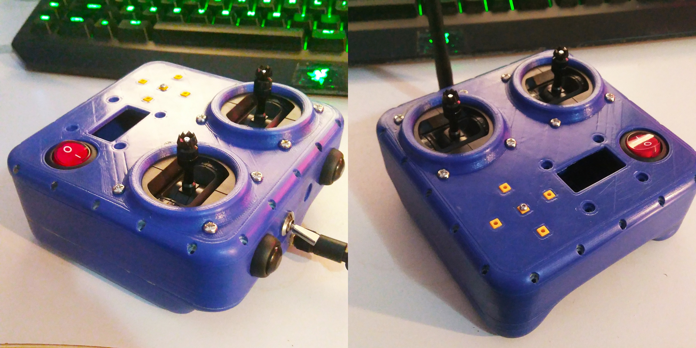

# ESP32Transmitter

ESP32 Based RC transmitter, talks FRSKY D8 (D16 Buggy for now) using a CC2500 module over SPI. 

Working:
Basic D8 mode and Calibration

Todo:
Integrate button code
OLED
Fix Buggy D16 code 

'Fevo' hardware, a modified turnigy evo by https://github.com/JyeSmith

